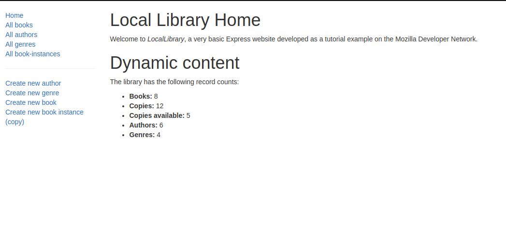

 

# Local Library

In this project I:

- Generated express app with Pug view;
- Installed nodemon package to auto-update my local server;
- Installed Mongoose Database;
- Created schemas and models;
- Populated the Database with some items to test;
- Created dummy controllers for the author, book instance, genre, and book;
- Created catalog router with routes to the controllers' actions;
- Edited all actions related to list the models and their specific details;
- Implemented the view templates related to the above actions;
- Added Bootstrap to the project;
- Installed moment package to format the dates;
- Installed express-validator package to validate inputted data;
- Edited all models create, delete and update actions in the controllers;
- Implemented all models view template forms for creating, updating, and deleting instances.

# What it does?

- When the App is executed, you will be able to:

  - View a list of all authors, books, book instances and genres;
  - Add authors, books, book instances and genres;
  - Update authors, books, book instances and genres;
  - Delete authors, books, book instances and genres;
  - View details of authors, books, book instances and genres.
  

## Built with

- Node.js
- Express
- Bootstrap
- Pug

## Live Demo

[Click here to see it on Heroku!](https://murilo-local-library.herokuapp.com/catalog)

## Getting Started

- Clone the repository on your local machine;
- Cd into the folder;
- Run `npm install`;
- Run `npm start`;
- Open your browser and type `localhost:3000`.

## Installations

- Install VSCode or any code editor you like;
- Install npm by running `npm install`;
- Install the latest versions of Node.js.

## Author

Murilo Roque Paiva da Silva

Github: [@MuriloRoque](https://github.com/MuriloRoque)

Twitter: [@MuriloRoquePai1](https://twitter.com/MuriloRoquePai1)

Linkedin: [MuriloRoque](https://www.linkedin.com/in/murilo-roque-b1268741/)

## 🤝 Contributing

Contributions, issues and feature requests are welcome! Start by:

- Forking the project
- Cloning the project to your local machine
- `cd` into the project directory
- Run `git checkout -b your-branch-name`
- Make your contributions
- Push your branch up to your forked repository
- Open a Pull Request with a detailed description to the development branch of the original project for a review

## Show your support

Give a ⭐️ if you like this project!